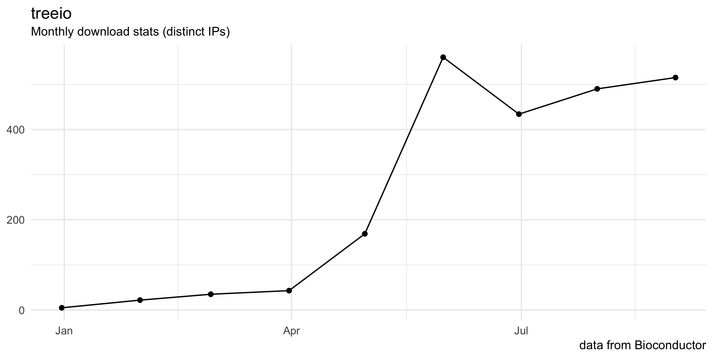

---
output:
  md_document:
    variant: markdown_github
html_preview: false
---

<!-- README.md is generated from README.Rmd. Please edit that file -->


#  treeio: Base classes and functions for phylogenetic tree input and output

```{r echo=FALSE, results="hide", message=FALSE}
#library("txtplot")
library("badger")
library("ypages")
library("ggplot2")
library("yyplot")
```


`r badge_bioc_release("treeio", "green")`
`r badge_devel("guangchuangyu/treeio", "green")`
[](https://www.bioconductor.org/packages/devel/bioc/html/treeio.html#since)
[](https://github.com/ropensci/onboarding/issues/179)


[](http://www.repostatus.org/#active)
[](https://codecov.io/gh/GuangchuangYu/treeio)
[)`-green.svg)](https://github.com/GuangchuangYu/treeio/commits/master)
[](https://github.com/GuangchuangYu/treeio/network)
[](https://github.com/GuangchuangYu/treeio/stargazers)


[](https://www.bioconductor.org/packages/devel/bioc/html/treeio.html#archives)
[](https://bioconductor.org/checkResults/devel/bioc-LATEST/treeio/)
[](https://travis-ci.org/GuangchuangYu/treeio)
[](https://ci.appveyor.com/project/GuangchuangYu/treeio)
[](https://twitter.com/intent/tweet?hashtags=treeio&url=http://onlinelibrary.wiley.com/doi/10.1111/2041-210X.12628/abstract&screen_name=guangchuangyu)


```{r comment="", echo=FALSE, results='asis', eval=FALSE}
cat(packageDescription('treeio')$Description)
```

`treeio` is an R package to make it easier to import and store phylogenetic tree
with associated data; and to link external data from different sources to
phylogeny. It also supports exporting phylogenetic tree with heterogeneous
associated data to a single tree file and can be served as a platform for
merging tree with associated data and converting file formats.

See the `treeio` project website, <https://guangchuangyu.github.io/software/treeio>, and
package vignette for more details.

### Vignettes

+ [Importing trees with data](http://bioconductor.org/packages/devel/bioc/vignettes/treeio/inst/doc/Importer.html)
+ [Exporting trees with data](http://bioconductor.org/packages/devel/bioc/vignettes/treeio/inst/doc/Exporter.html)


## Authors

Guangchuang YU <https://guangchuangyu.github.io>

School of Public Health, The University of Hong Kong

## Installation

Get the released version from Bioconductor:

```r
## try http:// if https:// URLs are not supported
source("https://bioconductor.org/biocLite.R")
## biocLite("BiocUpgrade") ## you may need this
biocLite("treeio")
```

Or the development version from github:

```r
## install.packages("devtools")
devtools::install_github("GuangchuangYu/treeio")
```

## Download stats

`r badge_download_bioc("treeio")`
`r badge_bioc_download("treeio", "total", "blue")`
`r badge_bioc_download("treeio", "month", "blue")`


```{r echo=F, comment=NA}
x <- dlstats::bioc_stats("treeio")
x <- x[-nrow(x), ] # last month data is not complete
p <- ggplot(x, aes(end, Nb_of_distinct_IPs)) + geom_point() + geom_line() +
    theme_minimal() +xlab(NULL) + ylab(NULL) +
    labs(title="treeio", subtitle="Monthly download stats (distinct IPs)", caption="data from Bioconductor")
ggsave(p, file="docs/images/dlstats.png", width=8, height=4)
```




## Contributing

We welcome any contributions! By participating in this project you agree to
abide by the terms outlined in the [Contributor Code of Conduct](CONDUCT.md).


## Package Affiliations

The `treeio` package is a part of the Bioconductor and rOpenSci projects.

| [](http://bioconductor.org) | [](http://ropensci.org) |
|:-------------------------------------------------------------------------------------------------------:|:----------------------------------------------------------------------------------------------:|

